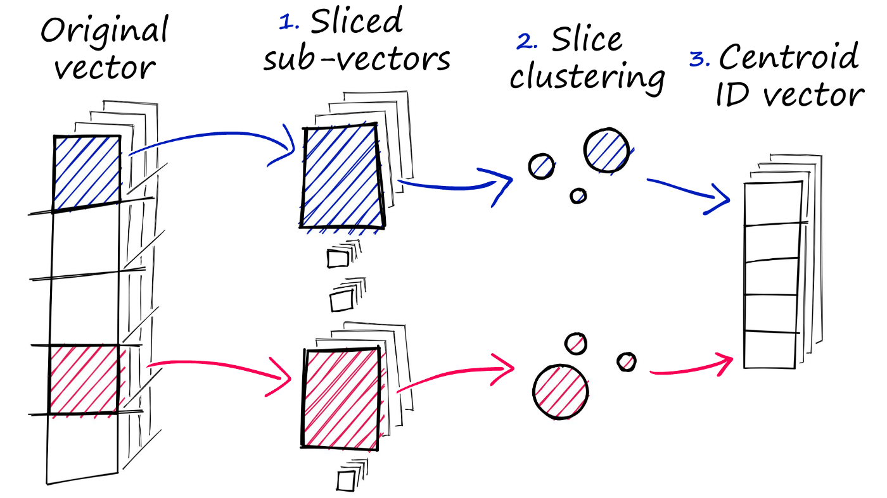
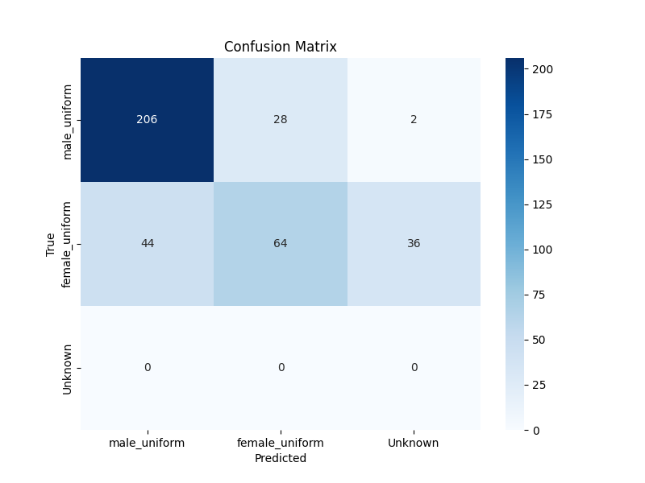

# UniformDetect

## Introduction

**UniformDetect** is a simple uniform recognition system based on **Deep Learning (ResNet)** combined with **Similarity Search (FAISS)**. 
Users can build **libraries** from uniform images and perform fast matching to check correct/incorrect uniforms.

---
## Installation 
Clone the repository:
   ```bash
   git clone https://github.com/Yor4-173/UniformDetect.git
   cd UniformDetect
   pip install -r requirement.txt

```

## Structure

```bash
UniformDetect/
│── models/
│   ├── resnet50_preTrain.pth       # Model ResNet50 pretrained (or fine-tuned)
│   ├── gallery.index               # FAISS index
│   ├── gallery_labels.pkl          # Labels corresponding to index
│
│──dataset/
│── train/
│   ├── female/
│   ├── male/ 
│
│── valid/
│   ├── female/ 
│   ├── male/ 
│
│── test/                    
│
│── src/
│   ├── build_gallery.py            
│   ├── dataset.py
│   ├── embeding_app.py
│   ├── loss.py
│   ├── model.py
│   ├── train.py                      
│
│── mainApp/
│   ├── faissChecker.py                
│   ├── resnetChecker.py       
│
│── README.md                       
```
## Facebook AI Similarity Search (Faiss)

Facebook AI Similarity Search (Faiss) is a library that uses similarity search together with vector clustering. Faiss was researched and developed by the Facebook AI Research team; written in C++ and packaged in Python. The library includes multidimensional vector search algorithms in similarity search



In this system, I use FAISS to build an Index Database for the embedding vectors of the uniforms. When receiving new images, the embeddings are matched with the gallery via FAISS to find the closest vector, thereby classifying the uniforms quickly and effectively, instead of having to compare each image sequentially.

## Training 

Train the embedding extraction model on the prepared dataset

```bash
    mkdir models
    cd src
    python train.py --train_dir dataset/train --val_dir dataset/valid --epochs 50 --batch_size 32 --lr 0.001 --save_path models/siamese_uniform.pth
```

You can use other versions of Resnet model pretrain instead if you want.

## Embedding

Extract embedding, create index database from sample dataset.

```bash
    cd src
    python build_gallery.py \
    --gallery-dir dataset/train \
    --weight models/resnet50_preTrain.pth \
    --index-path models/gallery.index \
    --label-path models/gallery_labels.pkl \
    --device cuda
```
## Run

```bash
    cd mainApp
    python faissChecker.py --model "model path" --img "image path" --gallery "gallery path" --k 3 --threshold 0.4
```
The result will print the top-3 nearest neighbors, label + distance, then evaluate whether the uniform is true or false according to the threshold.

## Evaluation

Test the model's performance on the valid set (or another test set that you prepare)

```bash
    python -m mainApp.evaluate \
  --test_dir "data test path" \
  --model_path "model path" \
  --index_path "galerry path" \
  --labels_path "path to gallery_labels.pkl" \
  --threshold 0.4
```

<div align="center">



</div>

